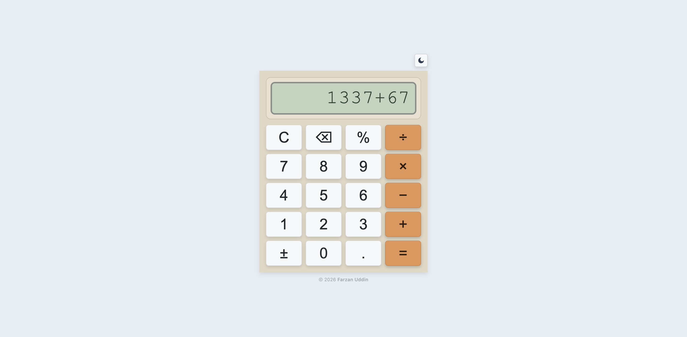

# Calc

A keyboard-accessible calculator built with Vue 3 and TypeScript. Supports basic arithmetic operations, a light and dark theme, and a responsive mobile layout.

[https://farzanuddin.github.io/calc](https://farzanuddin.github.io/calc/)



## Objective

This project was built as a hands-on exploration of two things: getting back up to speed with Vue after not having used it for a while, and evaluating the newly released Vite 8 — specifically how [Rolldown](https://rolldown.rs/) works as its bundler under the hood. Rolldown replaces the previous Rollup-based pipeline with a Rust-native bundler, and a small but real project felt like the right way to observe its build performance and output characteristics in practice.

## Features

- **Basic arithmetic** — addition, subtraction, multiplication, division, and percentage
- **Chained operations** — apply multiple operators in sequence without pressing equals
- **Light/dark mode** — theme persisted to `localStorage`, with automatic detection of system preference on first load
- **Keyboard support** — full keyboard input for digits, operators, Enter, Backspace, and Escape
- **Haptic feedback** — optional vibration on button press on supported mobile devices
- **Error handling** — gracefully catches division by zero and malformed states
- **Responsive layout** — fills the full screen on mobile with comfortable padding; fixed width on desktop

## Tech Stack

| Technology                                    | Version | Role                        |
| --------------------------------------------- | :-----: | --------------------------- |
| [Vue](https://vuejs.org/)                     | ^3.5.30 | UI framework                |
| [TypeScript](https://www.typescriptlang.org/) | ~5.9.3  | Language                    |
| [Vite](https://vitejs.dev/)                   | ^8.0.0  | Build tool & dev server     |
| [Tailwind CSS v4](https://tailwindcss.com/)   | ^4.2.1  | Utility-first CSS framework |
| [Vitest](https://vitest.dev/)                 | ^4.1.0  | Unit testing                |
| [Prettier](https://prettier.io/)              | ^3.8.1  | Code formatter              |

## Getting Started

1. Install dependencies:

   ```bash
   pnpm install
   ```

2. Start the dev server:

   ```bash
   pnpm dev
   ```
